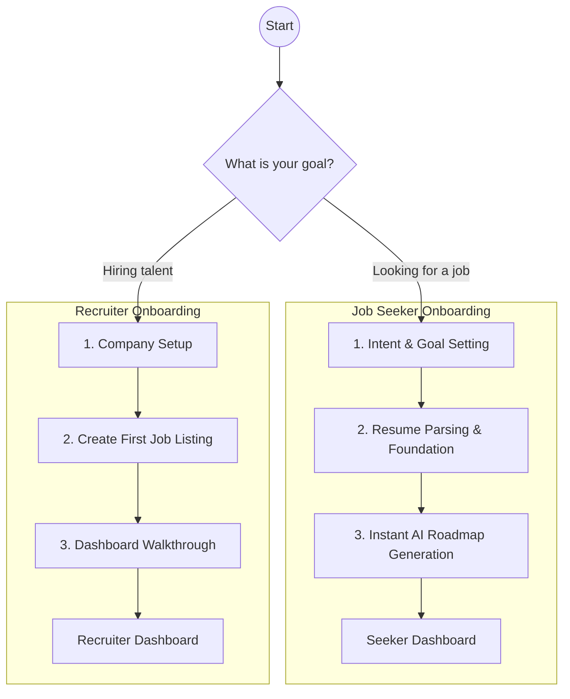
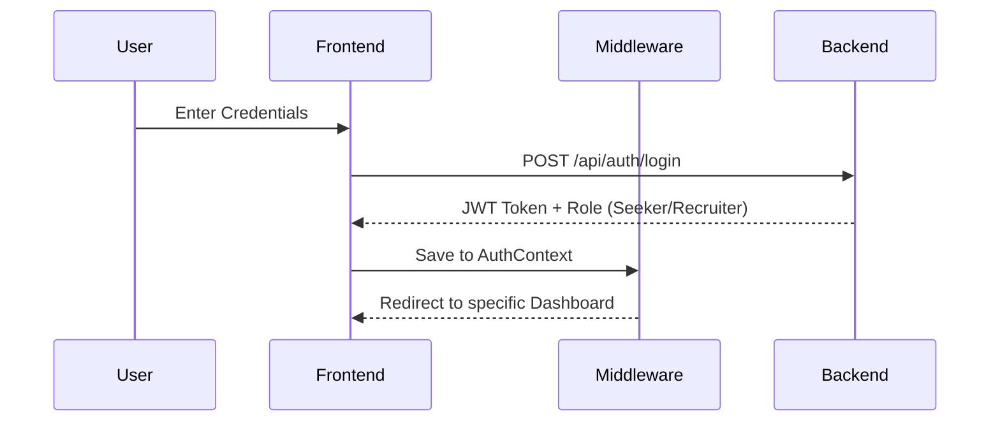
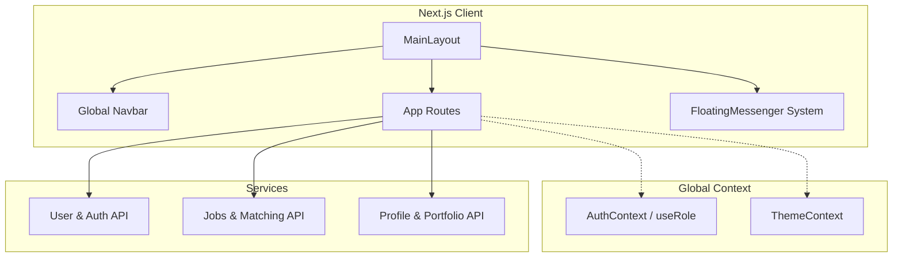

# 🚀 Project VIJ: Master Architecture & Blueprint

> [!IMPORTANT]
> This document serves as the master blueprint for **Project VIJ**. It details the core logic, business rules, system architectures, workflows, and folder hierarchies required to build the most advanced dual-role professional networking platform.

---

## 👁️ 1. Project Vision
**Project VIJ** aims to completely redefine the professional networking space by fusing the structured credibility of traditional job boards (like LinkedIn) with the engaging, snackable, and visually appealing storytelling of modern social media (like Instagram). 

**Key Objectives:**
- **For Job Seekers**: Replace the static resume with a dynamic "Social Professional Profile" featuring Story Reels, verified skill badges, and AI-driven career roadmaps.
- **For Recruiters**: Provide an instant, visually verified talent pipeline with "Talent Radar" map integrations and drag-and-drop Kanban applicant tracking.

---

## 🧠 2. Core Logic & Business Rules

### 2.1 Dual-Role Segregation
The platform is built on a strict dual-role architecture.
- **Job Seeker**: Focuses on discovering jobs, updating their career roadmap, and presenting their portfolio.
- **Recruiter**: Focuses on company branding, posting jobs, and headhunting via the Talent Pipeline.

> [!NOTE]
> Every API request and UI component utilizes the global `AuthContext` and custom `useRole()` hook to conditionally restrict or grant access. 

### 2.2 AI-Driven Personalization
- **Smart Matching**: Job cards are not just listed; they are scored (e.g., "94% Match") based on parsed resume data and the user's active goals.
- **Instant Roadmaps**: Based on the gap between a user's current skills and their goal, the system generates a 3-month timeline of actionable milestones.

---

## 🌊 3. System Workflows

### 3.1 Dual Onboarding Flow

### 3.2 Authentication Flow

---

## 🏛️ 4. Application Architecture (Directory Hierarchy)

The application is structured using a **Feature-Driven Architecture**, ensuring highly modular and scalable code.

### 📁 `src/app/` (Pages & Routes)
Handles all Next.js App Router endpoints.
- **`(main)/`**: Protected and core platform routes.
  - `page.tsx` ⮑ **Home Page**
  - `about/` ⮑ **About Us**
  - `network/` ⮑ **Network & Connections**
  - `jobs/` ⮑ **Jobs Board**
    - *Sub-pages*: Job Cards, Job Details (e.g., `/jobs/[id]`)
  - `salary-insights/` ⮑ **Salary Details & Breakdowns**
  - `companies/` ⮑ **Company Directory**
    - *Sub-pages*: Company Profile Details
  - `onboarding/` ⮑ **Dual Onboarding Wizard**
  - `profile/me/` ⮑ **Social Professional Profile**
  - `seeker/dashboard/` ⮑ **Job Seeker Dashboard**
  - `recruiter/dashboard/` ⮑ **Recruiter Dashboard**
  - `settings/` ⮑ **Settings & Configuration**

### 📁 `src/features/` (Domain Logic)
Self-contained business modules encompassing their own UI and logic.
- **`auth/`**: Authentication forms, role-selection components.
- **`onboarding/`**: Steps and wizards for Seeker/Recruiter flows.
- **`profile/`**: The core social identity.
  - *Components*: `ProfileHero`, `ProfileReels` (Instagram-style), `PortfolioGrid` (Bento layout), `CredentialBadges`.
- **`dashboard/`**: Specialized dashboard UI logic.
  - *Components*: `SeekerDashboard`, `RecruiterDashboard`.
- **`roadmap/`**: AI Career roadmap tracking and visualization.
- **`recruiter/`**: Recruiter-specific tools.
  - *Components*: `TalentPipeline` (Kanban), `JobListingsGrid`, `AnalyticsSnapshots`.

### 📁 `src/components/` & `src/ui/` (Presentation)
- **`shared/`**: Reusable complex elements (`GlassCard`, `BentoGrid`, `PipelineKanban`).
- **Global Systems**:
  - `NotificationDropdown`: Global notification hub for matches and alerts.
  - `FloatingMessenger`: Persistent chat hub mapped to the bottom-right of the screen.
- **`ui/`**: Atomic elements (Buttons, Inputs, Modals, Tooltips).

### 📁 `src/systems/` (Core Platform Systems)
- **Filtration System**: Global search logic filtering jobs and network by salary, proximity, and skills.
- **Messaging System**: Persistent chat interface for direct communication.
- **Notification System**: Real-time push alerts.

### 📁 `src/context/` (Global State)
- `AuthContext.tsx`: Manages user session, JWTs, and role identification.
- `ThemeContext.tsx`: Manages the Liquid Glass aesthetics (e.g., background blur, custom images).

### 📁 `src/hooks/` (Custom React Hooks)
- `useRole.ts`: Determines if the user `isSeeker` or `isRecruiter`.
- `useFiltration.ts`: Handles global state for search and filters.

### 📁 `src/services/` (API & Data Fetching)
- Handlers for external API requests (e.g., `dashboardAPI.ts`, `profileAPI.ts`).

### 📁 `src/layouts/`
- `MainLayout.tsx`: The primary wrapper containing the responsive header, sliding navigation indicators, and liquid glass background overlays.

### 📁 `src/assets/` & `src/data/`
- **`assets/`**: Static imagery, global SVGs, and branding.
- **`data/`**: Static configuration JSONs (e.g., `onboarding-content.json`).

---

## 🎨 5. UI / UX Strategy & Aesthetics

> [!TIP]
> The primary design philosophy is **Liquid Glass Bento Grids**. Every major UI element should feel tactile, modern, and visually stunning.

### 5.1 Design System Guidelines
- **Liquid Glassmorphism**: Heavy use of frosted panels using `backdrop-filter: blur(24px)`, semi-transparent white/black backgrounds, and glowing borders.
- **Bento Grid Layouts**: Dashboards and profiles are constructed using neatly packed, asymmetrical grid cards (Bento style). This ensures maximum readability on mobile and desktop.
- **Typography**: Inter / Plus Jakarta Sans. Oversized headings, generous negative space, and clear visual hierarchy.
- **Micro-Animations**: Extensive use of `framer-motion` for fluid transitions, hover scales, and dynamic page routing.

### 5.2 System Theming 
- **Notification & Messaging Systems**: Designed to be non-intrusive. We abandoned aggressive reds for a **Simple, Classic Smooth Light Green** theme (`#059669`, `#e6f6ec`).
- **No Hover Clutter**: For critical interactive elements (like the messenger FAB and notification bell), hover animations are intentionally disabled to create a solid, stable, and classic feel.

---

## ⚙️ 6. System Architecture Diagram

